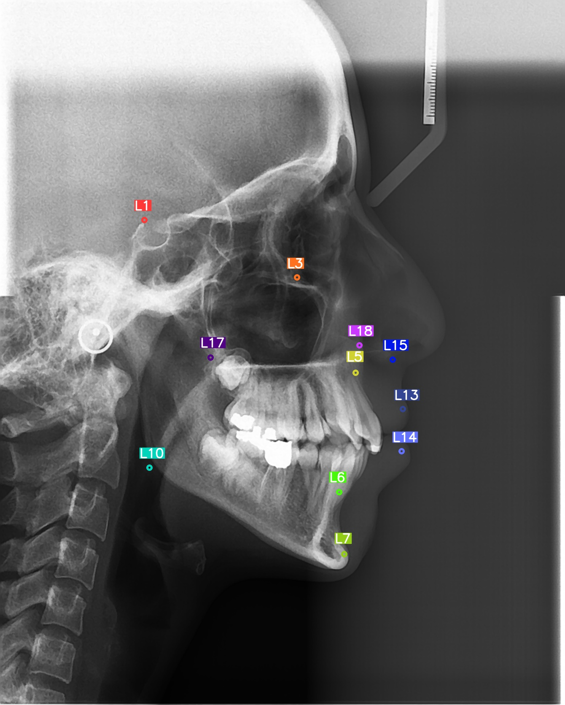
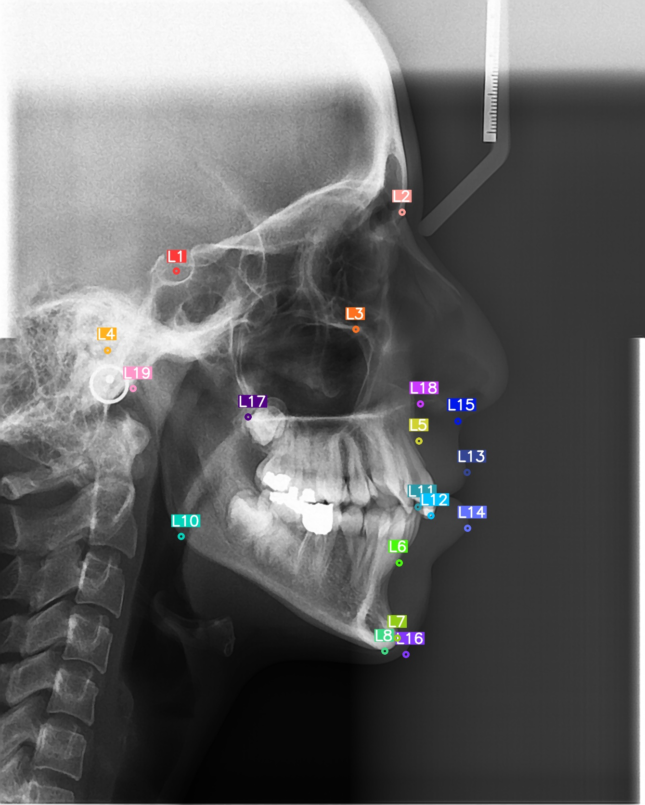
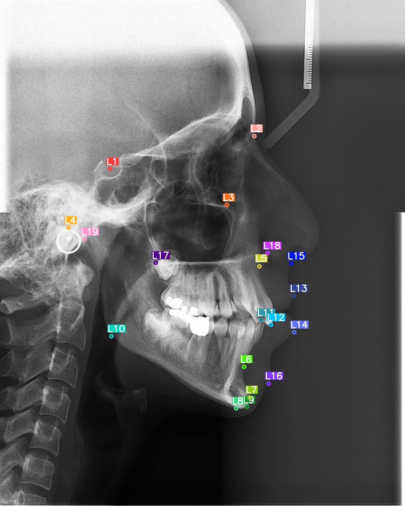

# Cephalometric_landmarking
Medical image processing - cephalometric landmarking

Usage:

For using model Run bellow command
```
 python CL.py
```

result:

1- Before augmentation


2- After augmentation on [ISBI dataset](https://doi.org/10.1016/j.media.2016.02.004)


3- After fine tunning on hamedan_university_dataset **(available in repo)**

